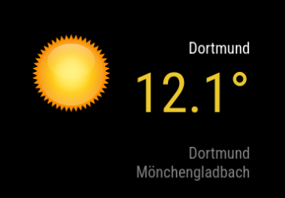

# MMM-Best-Weather

A [MagicMirror²](https://github.com/MagicMirrorOrg/MagicMirror) module that displays the German city with the best current weather, selected from a configurable list of 45 cities using an HCI-adapted (Holiday Climate Index) scoring system based on [Open-Meteo](https://open-meteo.com/) data.



## Features

- HCI-adapted scoring of 45 German cities using apparent temperature, cloud cover, precipitation and wind
- Gaussian thermal comfort curve (configurable optimal temperature and width)
- Weather code override multipliers for severe weather penalties
- Temperature-sensitive color gradient (matching personal weather station display)
- Day/night weather icons (using suncalc)
- Optional HCI score display next to city name
- Optional TOP1 city history display
- Dynamic update interval based on Open-Meteo API limits
- Statistics logging to CSV with sub-scores (for analysis)
- Multi-language support (English, German)

## Score Formula

### Background

The original scoring formula was a simple linear combination of temperature and weather factors. Statistical analysis of 13,000+ data points (Sep 2025 – Feb 2026) revealed that temperature alone explained ~90% of the score variance (R² = 0.90), making it effectively a temperature proxy. As a result, 60% of all TOP1 selections had overcast skies — the module picked the warmest city, not the one with the best weather.

The revised formula is adapted from the **Holiday Climate Index (HCI)**, a well-established meteorological index for rating outdoor weather quality. The HCI was developed by Scott, Rutty, Amelung & Tang (2016) as a successor to the Tourism Climate Index (TCI, Mieczkowski 1985). Key design principles adopted from the HCI:

- **Thermal comfort is not linear** — both too cold and too hot reduce comfort. A Gaussian bell curve around an optimal temperature models this naturally, unlike the old linear approach where higher temperature always meant a higher score.
- **Three independent facets** — thermal comfort, aesthetic conditions (sunshine/cloud), and physical conditions (rain/wind) are rated separately before combining. This prevents one dominant factor from masking the others.
- **The worst physical factor dominates** — heavy rain ruins outdoor weather regardless of wind, and vice versa. Using `min(pRain, pWind)` models this correctly.
- **Apparent temperature over air temperature** — wind chill and humidity are already integrated via the Steadman formula, yielding a more realistic comfort assessment.

### References

- Scott, D., Rutty, M., Amelung, B., & Tang, M. (2016). *An Inter-Comparison of the Holiday Climate Index (HCI) and the Tourism Climate Index (TCI) in Europe.* Atmosphere, 7(6), 80.
- Mieczkowski, Z. (1985). *The Tourism Climatic Index: A Method of Evaluating World Climates for Tourism.* The Canadian Geographer, 29(3), 220–233.
- Steadman, R. G. (1979). *The Assessment of Sultriness. Part I: A Temperature-Humidity Index Based on Human Physiology and Clothing Science.* Journal of Applied Meteorology, 18(7), 861–873.
- de Freitas, C. R., Scott, D., & McBoyle, G. (2008). *A Second Generation Climate Index for Tourism (CIT).* International Journal of Biometeorology, 52(5), 399–407.

### Formula

```
HCI Score = (0.4 × TC + 0.2 × A + 0.4 × P) × 10 × WC_Override
```

**Result range: 0–100** (higher = better weather for outdoor activities)

The weights (40/20/40) are adapted from the HCI:Beach variant (Scott et al. 2016), which assigns the highest importance to thermal comfort and physical conditions, with a smaller role for aesthetics. The WC_Override multiplier is a module-specific addition that caps the total score during severe weather events (thunderstorms, heavy snowfall) regardless of component scores.

### Thermal Comfort — TC (40%)

Gaussian bell curve around the optimal apparent temperature:

```
TC = 10 × exp(-0.5 × ((apparent_temp - tOpt) / sigma)²)
```

Uses `apparent_temperature` (feels-like temperature per Steadman 1979), which integrates wind chill and humidity into a single perceived temperature. The Gaussian curve peaks at `tOpt` (default 22°C) and drops symmetrically — both cold and hot extremes reduce comfort equally. The width parameter `sigma` (default 10) controls how quickly comfort falls off.

**Examples:** 22°C → TC=10.0 | 12°C → TC=6.1 | 2°C → TC=1.4 | 32°C → TC=6.1 | -5°C → TC=0.5

### Aesthetic — A (20%)

Cloud cover rating. Research (de Freitas et al. 2008) shows that 10–20% cloud cover is perceived as aesthetically optimal — small cumulus clouds enhance a blue sky, while a completely clear sky can feel "empty". The piecewise function reflects this:

| Cloud Cover | Score | Description |
|------------|-------|-------------|
| 0–20% | 9.0–10.0 | Optimal — mostly clear with possible fair-weather clouds |
| 20–50% | 7.0–10.0 | Declining — increasing cloud dampens appeal |
| 50–100% | 2.0–7.0 | Poor — overcast, grey skies |

### Physical — P (40%)

Combined precipitation and wind rating. The worse factor dominates (min-operator), because either heavy rain or strong wind alone is sufficient to ruin outdoor comfort:

```
pRain = clamp(10 - precipitation × 3, 0, 10)    // 0 mm → 10, 3.3+ mm → 0
pWind = clamp(10 - windSpeed × 0.2, 0, 10)      // 0 km/h → 10, 50+ km/h → 0
P = min(pRain, pWind)
```

The precipitation factor drops sharply (×3) because even light rain (1–2 mm/h) significantly degrades outdoor weather quality. Wind is weighted more gently (×0.2) — moderate winds are tolerable, only storms are truly disruptive.

### Weather Code Override — WC_Override

Multiplier (0.0–1.0) applied to the total score based on the WMO weather code reported by Open-Meteo. This acts as a safety net: even if the numeric sensor values (temperature, cloud, wind) look acceptable, certain weather phenomena (freezing rain, thunderstorms, dense fog) make outdoor conditions objectively bad. The override ensures these situations are properly penalized.

**Examples:** Clear sky → 1.0 | Overcast → 0.9 | Moderate rain → 0.4 | Thunderstorm → 0.2 | Hail → 0.1

### Example Calculations

**Summer sunny day** (apparent_temp=24°C, cloud=10%, no rain, WC=0 clear):
- TC = 10 × exp(-0.5 × (2/10)²) = 9.80
- A = 9 + 10/20 = 9.50
- P = min(10, 10) = 10.0
- Score = (0.4×9.80 + 0.2×9.50 + 0.4×10.0) × 10 × 1.0 = **98.2**

**Winter fog** (apparent_temp=0.2°C, cloud=100%, no rain, WC=45 fog):
- TC = 10 × exp(-0.5 × (-21.8/10)²) = 0.09
- A = 7 - (100-50) × 0.1 = 2.00
- P = min(10, 10) = 10.0
- Score = (0.4×0.09 + 0.2×2.00 + 0.4×10.0) × 10 × 0.7 = **30.9**

## Installation

```bash
cd ~/MagicMirror/modules
git clone https://github.com/rkorell/MMM-Best-Weather.git
cd MMM-Best-Weather
npm install
```

## Configuration

Add to your `config/config.js`:

```js
{
    module: "MMM-Best-Weather",
    position: "bottom_left",
    config: {
        tOpt: 22,                  // Optimal apparent temperature (°C)
        sigma: 10,                 // Gaussian curve width
        showScore: false,          // Show HCI score next to city name
        showTop1History: true,
        decimalPlacesTemp: 1,
        tempSensitive: true,
        cityColor: "white",
        historyColor: "grey",
        openmeteoMaxQueriesPerDay: 5000,
        tempColorGradient: [
            { temp: -20, color: "#b05899" },
            { temp: -14, color: "#6a4490" },
            { temp: -10, color: "#544691" },
            { temp:  -5, color: "#484894" },
            { temp:  -1, color: "#547bbb" },
            { temp:   4, color: "#70bbe8" },
            { temp:   8, color: "#c2ce2c" },
            { temp:  12, color: "#ecc82d" },
            { temp:  16, color: "#eebf2e" },
            { temp:  20, color: "#eec12c" },
            { temp:  24, color: "#e2a657" },
            { temp:  27, color: "#db8f32" },
            { temp:  30, color: "#bb5a20" },
            { temp:  32, color: "#c04117" }
        ]
    }
}
```

### Config Options

| Option | Type | Default | Description |
|--------|------|---------|-------------|
| `tOpt` | float | `22` | Optimal apparent temperature for Gaussian comfort curve (°C) |
| `sigma` | float | `10` | Gaussian width — how quickly comfort score drops away from tOpt |
| `wcOverrides` | object | see below | Weather code override multipliers (0.0–1.0) |
| `showScore` | bool | `false` | Show HCI score (0–100) next to city name |
| `showTop1History` | bool | `false` | Show last 2 TOP1 cities |
| `decimalPlacesTemp` | int | `1` | Decimal places for temperature display |
| `tempSensitive` | bool | `true` | Enable temperature-based color gradient |
| `tempColorGradient` | array | see above | Temperature-to-color mapping for gradient |
| `cityColor` | string | `"white"` | Color of the city name |
| `historyColor` | string | `"grey"` | Color of the TOP1 history |
| `temperatureColor` | string | `"white"` | Fixed temperature color (when `tempSensitive: false`) |
| `openmeteoMaxQueriesPerDay` | int | `5000` | API query budget per day |
| `statisticsFileName` | string | `"BestWeatherStatisticsHCI.csv"` | Statistics output file |
| `animationSpeed` | int | `1000` | DOM update animation (ms) |

#### Default Weather Code Overrides

| Weather Code | Condition | Multiplier |
|-------------|-----------|------------|
| 0, 1, 2 | Clear / mainly clear / partly cloudy | 1.0 |
| 3 | Overcast | 0.9 |
| 45, 48 | Fog / rime fog | 0.7 |
| 51, 53, 55 | Drizzle | 0.7 |
| 56, 57 | Freezing drizzle | 0.5 |
| 61 | Rain: slight | 0.6 |
| 63 | Rain: moderate | 0.4 |
| 65, 66, 67 | Rain: heavy / freezing | 0.3 |
| 71, 73, 77 | Snow: slight–moderate / grains | 0.4 |
| 75 | Snow: heavy | 0.3 |
| 80 | Rain showers: slight | 0.5 |
| 81, 82 | Rain showers: moderate–violent | 0.3 |
| 85 | Snow showers: slight | 0.4 |
| 86 | Snow showers: heavy | 0.3 |
| 95 | Thunderstorm | 0.2 |
| 96, 99 | Thunderstorm with hail | 0.1 |
| (unknown) | Default fallback | 0.5 |

## Statistics

When `statisticsFileName` is set, the module logs each update to a CSV file with the following columns:

```
Timestamp;City;WeatherCode;Temperature;ApparentTemperature;Humidity;CloudCover;Precipitation;WindSpeed;TC;A;P;WC_Override;Score
```

This enables post-hoc analysis and tuning of the scoring parameters.

## Cities

The module evaluates 45 German cities defined in `cities.json`. Each entry contains city name, state, latitude and longitude. The list can be customized.

## API

Uses the free [Open-Meteo API](https://open-meteo.com/) — no API key required. The module dynamically calculates its update interval to stay within the configured daily query limit.

## Dependencies

- [node-fetch](https://www.npmjs.com/package/node-fetch) — HTTP requests
- [suncalc](https://www.npmjs.com/package/suncalc) — Day/night icon determination

## License

MIT — Dr. Ralf Korell
